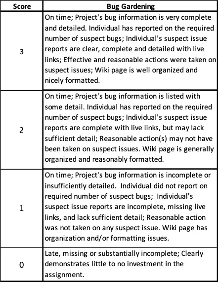

# Bug Gardening Activity

## Introduction

**Bug gardening** is a name often given to the task of maintaining the issue tracker in a project. This name reflects the fact that without careful attention, issues trackers tend to become disorganized - like an overgrown garden. They will accumulate tickets that are unlabeled, redundant/duplicates, inaccurate, or describe bugs that no longer exist in the current version of the software. Bug gardening thus includes things such as assigning tags and/or priorities to tickets, confirming the existence of reported bugs, requesting additional information on submitted tickets, adding useful information to existing tickets, eliminating duplicate tickets, connecting potentially related tickets, closing completed or out of date tickets, etc. While some of these activities are done by the maintainers (e.g. prioritizing, deleting or labeling tickets) many others can be done by the community.

## Assignment

In this assignment you will engage as part of your project's community by doing some bug gardening. More specifically you will:
- Develop an understanding of your project's process for dealing with bugs/issues.
- Help with the maintenance of your project's issue tracker by Bug Gardening.

### Getting Started:

For this activity there will be a number of deliverables that will be collectively produced by your project team and posted to the team Wiki page.

1. Click the link for your team under the "Project Deliverables" heading on the [H/FOSS Projects Page](https://lms.dickinson.edu/mod/wiki/view.php?pageid=2076).
2. Create a new page there for your team's "Project Deliverables". You will use this page for the remainder of the semester to collect and organize materials from your Team's Project work. This page should contain:
   a. The heading "Project Deliverables"
   b. A section for "The Project", with the basic information about your project (e.g. name, links to the main web pages and repositories).
   c. A section for "The Team", with your names and links to the individual Wiki pages you created earlier in the semeter.
   c. New sections as described below and in future assignments.
   d. Back links to parent pages at the bottom (as done on other pages you've created).
3. Add a section for "Bug Gardening" that links to a new page.  All of the work for this assignment should appear on this new "Bug Gardening Page".
4. Create the new "Bug Gardening" page.

All of the team members will be adding information to your "Bug Gardening" Wiki page throughout the activity. However, it is the full team's responsibility to keep your Team's "Project Deliverables" and "Bug Gardening" Wiki pages well organized and nicely formatted.

### Collecting the Project's Bug Information:

Every H/FOSS project worth its salt will have an issue tracker. In addition to that many projects also have resources (documents/communication channels/etc) that describe the processes and expectations for reporting/triaging/fixing issues or provide ways to discuss issues.

- Find and read all of the bug/issue related resources that your project provides. Be sure to find the issue tracker itself, guides on how to report a new issue/bug (e.g. what information to include or how to format the ticket), information about how developers claim tickets on which they plan to work, and how bug/issue fixes are contributed back to the project (e.g. how to make a pull request).
- Create a heading of "Bug Resources" on your team's "Bug Gardening" Wiki page.
- Collectively as a team, create an annotated list of all of the useful bug/issue related resources that you found.  This list should be a one-stop shop for all of the information you need about dealing with issues in your project. Each entry should contain a live link to the resource that you have found and a sentence or two describing what the resource is.
- Finally, before continuing read Simon Tatham's article on [How to Report Bugs Effectively](http://www.chiark.greenend.org.uk/~sgtatham/bugs.html).

### Gardening for "Suspect Tickets":

In this part of the activity you will try to help your project by doing some bug gardening. Specifically you will investigate *suspect tickets* in the issue tracker for your project. A suspect ticket is one that is still open (i.e. has not been closed) but that may not actually exist in the current version of the product. Suspect tickets can arise in a variety of ways. Someone may simply have forgotten to close the ticket, someone may have re-discovered and fixed the issue while working on another ticket or the relevant features may have been eliminated from the product.

To identify suspect tickets, you might look at old tickets, tickets with version numbers that do not match the current version of the product, and older tickets marked as low priority. Any information that you were able to identify earlier about how the project handles/processes issues may also help in finding suspect bugs (e.g. if the project uses an in-progress tag for tickets undergoing active work, a ticket tagged in-progress but that hasn't been updated in a long time might be suspect). The best suspect bugs to investigate will be those with a detailed list of steps for replicating a bug. If you have trouble identifying suspect tickets, you might reach out to the community and explain (briefly) what you are trying to do. They may then have suggestions for how to identify suspect tickets in the project or suggestions for other related things you might do to help maintain the issue tracker. If the community has other suggestions, please discuss them with the course faculty to possibly arrange alternative criteria for this assignment..

Your team may divide and organize this work as you see fit with the following constraints:
- Each team must investigate at least three suspect tickets per team member.
- Every team member must assist with the investigation of at least three suspect tickets.

For example, you may work in pairs, where each pair investigates three suspect tickets.  Someone might work individually and investigate three suspect tickets of their own.  You might work as a full team and investigate all of the tickets together.  

Your team must:
- Decide on a plan and post the details of it to a message in your Teams's slack channel.

#### Reporting "Suspect Tickets":

All of the suspect bugs investigated by the team should collected together and documented under the heading "Suspect Tickets" on your team's "Bug Gardening" Wiki page.

This section of the Wiki page should include a table with one row for each suspect ticket. The information in this table should be brief. The sample table below shows the required columns, gives a short explanation of each column and a few sample rows:

| __Bug ID__	| __Members__ | __Description__ | __Why Suspect__ | __Exists__	| __Actions__ |
|-------------|-------------|-----------------|---------------------|-------------|-------------|
| _The identifier for the bug as a live link into the project's issue tracker_ | _Initials of the team members investigating this issue_ | _A short description of the issue in your own words_ | _A short explanation of why you found the issue suspect_ | _Yes if you were able to confirm existence of the issue in the latest version. No, if you were were able to confirm it does not exist. Uncertain, if neither yes or no. Also include brief explanation for your answer._ | _Description of any action taken on the bug. If you comment on the ticket or elsewhere, include live links that document your actions._ |
| [1234](http://example.com/link1234.html) | GB/XY| Deposit field allows negative amounts. |	Ticket dated 2008, latest version released 2016. |	No. Followed steps in ticket to reproduce and negative amount was rejected. |	Commented on the ticket [here](ttp://example.com/sample.html) suggesting that it be closed. |
| [X5432b](http://example.com/linkX5432b.html) | 	GB/XY	| UI is unresponsive when sorting data.	| Ticket posted for version 1.3, latest product version is 2.7.	| Yes. Confirmed unresponsiveness when sorting the very large test data set.	| Commented on the ticket [here](ttp://example.com/sample.html) indicating problem was seen in Version 2.7 using the large test data set, but was not noticeable with the small test data set. |
[AB392c](http://example.com/linkAB392c.html) | JM/PQ | Program crashes on dates before 1970.	| Ticket dated 2010, had lots of comments and but no resolution.	| Uncertain. | We were unable to replicate bug because steps for replication were incomplete/unclear with regard to the latest version. Commented on the ticket [here](ttp://example.com/sample.html) explaining source of confusion and asking for clarification. |
| [9876](http://example.com/link9876.html) | JM/FS | About dialog gives incorrect copyright year. |	Ticket dated 2020, but good first issue tag suggests it should be easy to fix. |	Yes. Followed steps in ticket to reproduce and copyright is still incorrect. |	No action taken. |

If members of your team happen to identify a new issue that does not already appear in the issue tracker you may open a new ticket for that issue in lieu of one of the suspect issues. The corresponding row in the table above should link to the new ticket and describe the issue.  If you go this way, be sure to do a thorough search of the issue tracker before reporting a new issue.

## Grading

The Bug Gardening assignment will be assessed using the rubric below.

Coming Soon!

<!--
_Click rubric to enlarge image._ 

-->

<!--
## Completion Criteria

The completion criteria that each sub-team must demonstrate for this activity are:
- A link on the team wiki to a Bug Activities page.
- A single, nicely formatted Bug Activities page built collaboratively by all sub-teams on the project. This page must include the following sections and information:
  - __Bug Resources:__ An annotated list of all of the bug related resources for the project.
  - __Suspect Bugs:__ The table of suspect bugs that were investigated along with the actions that were taken as described above. Links in this table that qualify as Interactions or Contributions should also be linked in the sub-sections below. Yes, this is repeated information, but the separate organization is helpful to your instructor.
  - __Interactions:__ An annotated list, with links if possible, of any interactions that your team or sub-team had with the community during this activity (e.g. message board posts, mailing list messages, comments/clarifications on issues, etc.). Please indicate the date of the interaction and the sub-team that had the interaction. Note: Interactions are not required for this activity. However if they occur, please link them here for reference.
  - __Contributions:__ An annotated list, with links if possible, of any contributions that your team or sub-team made to the project during this activity (e.g. corrections/clarifications/additions to documentation, closed issues, etc.). Please indicate the date of the contribution and the sub-team that made the contribution. Note: Contributions are not required for this activity. However if you discover interesting information about a bug, you are highly encouraged to contribute what you find back to the community. If you do comment on an issue ticket, please include the link here for reference.

Each team member must be able to:
- Participate competently in a discussion of the bug resources for the project.
- Show and competently discuss the issue ticket for one suspect bug (e.g. What is the issue? Why is it suspect?) Each sub-team member must select a different suspect bug.
- Walk through a demonstration of what was done to investigate the suspect bugs.
- Competently discuss the actions that were taken and show any artifacts (i.e. interactions or contributions) related to the actions.
-->

---

Acknowledgements: This assignment builds from and adapts ideas and content from the following activities created by others:
- http://foss2serve.org/index.php/Bug_Gardening
- http://foss2serve.org/index.php/Bug_Selection
- http://foss2serve.org/index.php/Research_Bug_Activity
- http://foss2serve.org/index.php/Solving_A_Bug
- http://foss2serve.org/index.php/Writing_a_bug_report

---

 All textual materials used in this course are licensed under a [Creative Commons Attribution-NonCommercial-ShareAlike 4.0 International License](http://creativecommons.org/licenses/by-nc-sa/4.0/)

 All executable code used in this course is licensed under the [GNU General Public License Version 3 or later](https://www.gnu.org/licenses/gpl.txt)
