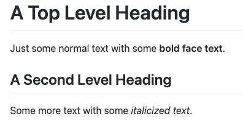

## PA01: Course Tools

### Introduction

Professional and open source software developers make use of many different tools each with its own purpose, strengths and weaknesses. We will be making use of a variety of such tools (Teams, git/GitHub, Markdown, Teammates, Blog) in this class. In addition, you will find yourselves needing to use a number of other tools to engage with the Free and Open Source Software (FOSS) community you select for your project.

The tools that we will use can be broadly divided into five categories:
- Messaging: Used for one-to-one and group communications. This includes platforms such as Teams, Slack, Discord, Gitter, IRC and Teams.  We will be using Teams.
- Version Control: Used for managing and collaborating on documents and source code. This includes tools such as git, Subversion, CVS and Mercurial, and platforms such as GitHub, GitLab, SourceForge and Bitbucket.  We will be using git and GitHub.
- Content Authoring Language: Used for writing and formatting text-based documents.  This includes things such as HTML, Markdown, LaTeX, and AsciiDoc.  We will be using Markdown.
- Performance Reviews: Used for conducting personnel reviews and providing feedback to teams. Many companies use proprietary tools and processes for annual reviews (e.g. [360 Reviews](https://www.thebalancemoney.com/what-is-a-360-review-1917541)).  We will be using Teammates.
- Communications: Used to self-publish information about you, your project or other topics. Many project communities will run a blog that keeps community members up to date on what is happening in the project. We will use [Blogger](https://www.blogger.com).

### Assignment

This assignment will prepare you to use the tools that we will employ in this course.  Each of the following sections focuses on one of our tools and gives you some tasks to complete. Completing the tasks will ensure that you are ready to use these tools in other assignments.

#### Teams

We will be using teams as our primary form of communication in this course.  All course related communication with the instructor and within your teams will take place on Teams. 

Complete the following tasks on Teams to find our course and to (re)familiarize yourself with it.
1. Find the COMP-491-492 Team in your browser or the Teams app.
2. Open the PA01 - Course Tools Channel
   1. Find "Introduce Yourself" post, read it, and post a response.
   2. Find the "Tag Someone" post, read it, and post a response.
   3. React to a at least one other post with a "Thumbs Up".
3. Use the Teams Chat feature to send a direct message to the course instructor with the GitHub username that you use for the [Dickinson COMP WiD](https://github.com/Dickinson-COMP-WiD) repository.

#### git/GitHub

We will be using git/GitHub pull requests to build a repository of completed assignments for this course. You will fork and clone this repository and add to it by making pull requests as you and your team work on assignments. You will also be using git and GitHub (or another repository hosting service) extensively in your work on your project.

Complete the following tasks using git/GitHub to find our course repository and to refresh your git/GitHub skills.  You may find this [Git/GitHub Command Reference]([Git/GitHub Command Reference](https://github.com/FarmData2/FD2-School-Materials/blob/main/GitReference/GitReference.md) helpful in remembering what commands to use.

1. If you have not already, accept the invitation to join the `Dickinson-COMP-491-491/AY25-26` repository as a contributor.
2. Fork the [Dickinson-COMP-491-491/AY25-26](https://github.com/Dickinson-COMP-491-492/AY25-26) repository into your GitHub account. 
   - By default your fork will be named just `AY25-26` you can give this a more meaningful name when you create your fork, or via the settings on your fork after you create it. 
   - Note that both the upstream repository and your fork are private. Thus, no one except students in our course and the Dickinson CS faculty will be able to see the repository or its contents.
3. Clone your fork to your machine.
4. Open your clone using an editor of your choice.
   - [VSCode](https://code.visualstudio.com/) or its FOSS alternative [VSCodium](https://vscodium.com/) are good choices that you can install for free if you do not already have a preferred editor.
5. Each of you has an individual directory within this repository.  In this step you will make changes to a file in that directory and create a pull request to have them merged into the upstream.
   1. Create a new feature branch from `main` for your changes.
   2. Find the `students` directory and your directory inside of it.
   3. Open the `README.md` file in your directory, it will be empty.
   4. Edit the file to include a sentence or two introducing yourself and what you are hoping to do after graduation.
   5. Save the file.
   6. Stage and commit your changes to the feature branch that you created.
      - Be sure to use a meaningful commit message that describes the change that you made.
   7. Push your feature branch to your origin on GitHub.
   8. Turn in your work by creating a pull request to the upstream for your changes.
      - Be sure to give your PR a descriptive title and comment.
    
#### Blog

We will be using [Blogger](https://www.blogger.com) for you to express your thoughts and opinions on technical, social, legal and ethical issues in computing and technology.

Complete the following tasks to setup a Blogger site.

1. Visit [Blogger](https://www.blogger.com)
2. Create a new Blog.
3. Customize your blog as you would like it to look.
4. Create a first post that gives a little bit of information about you and your goals.

#### Markdown

GitHub and many other platforms use Markdown as their content authoring language. Markdown uses basic syntax to allow you to style and format documents. On GitHub, this allows you to style (e.g. boldface, underline, links, etc) and structure (e.g. section headings, tables, images, etc) content in issues, pull requests and in any file with a `.md` extension.

For example, the following is a small markdown document that illustrates just a few of its capabilities:

```markdown
# A Top Level Heading

Just some normal text with some **bold face text**.

## A Second Level Heading

Some more text with some *italicized text*.
```

When rendered in GitHub this markdown will appear like this:



Use the documentation on the [Basic writing and formatting syntax](https://docs.github.com/en/get-started/writing-on-github/getting-started-with-writing-and-formatting-on-github/basic-writing-and-formatting-syntax) page and the [Organizing information with tables](https://docs.github.com/en/get-started/writing-on-github/working-with-advanced-formatting/organizing-information-with-tables) page to complete the following tasks and (re)familiarize yourself with Markdown.

1. Create a new feature branch from the feature branch you created in the prior section.
2. Add the following to your `README.md` file:
   1. A top level section header with your name.
   2. Second level section headers for "About Me", "My Schedule", "Assignments".
   3. In the "About Me" section:
      1. Move the text introducing yourself here.
      2. Add a ordered list of your favorite *somethings* (e.g. food, places, etc).
      3. Add a link related to your favorite *somethings*.
      4. Add an image related to your favorite *somethings*.
   4. In the "My Schedule" section add a table that displays your current course schedule. This table should have:
      - one column for each weekday.
      - one row for each time slot.
      - the name of each course in the appropriate cells.
   5. In the "Assignments" section add a links to:
      - Your GitHub profile.
      - The Blogger blog that you created.
3. Stage and commit your changes
4. Push your feature branch to your origin on GitHub
5. Turn in your work by creating a pull request to the upstream for your branch.

There is a lot more to Markdown than that, but once you have the basics, its easy enough to look up the rest when you need it.

#### Teammates

We will be using [Teammates](https://teammatesv4.appspot.com/web/front/home) to perform self-assessments, to give and receive anonymous peer-feedback, and to receive instructor feedback on project work.

Complete the following tasks to become familiar with how Teammates works.

1. If you have not already, use the link in the e-mail that you received from Teammates to register for our course.
2. Find the "PA-00" session in teammates:
   1. Click the "Start Submission" button for "PA-00"
   2. Complete the survey
      - This is just for practice so:
        - you have been assigned to made up teams for this exercise.
        - you won't have a basis for providing feedback so make things up, but be kind as jokes do not always land as expected over text based media.
        - be sure to respond to every question in some way just for practice.
   3. Submit the survey either question by question as you go or all at once at the end.
3. Check the responses that you receive. 
   - In this instance, you will see feedback immediately after it is submitted.
   - When we use TEAMMATES later you will receive feedback only after the instructor reviews and releases it.

---

 All textual materials used in this course are licensed under a [Creative Commons Attribution-NonCommercial-ShareAlike 4.0 International License](http://creativecommons.org/licenses/by-nc-sa/4.0/)

 All executable code used in this course is licensed under the [GNU General Public License Version 3 or later](https://www.gnu.org/licenses/gpl.txt)
