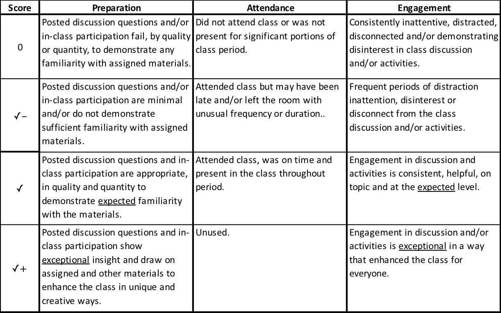
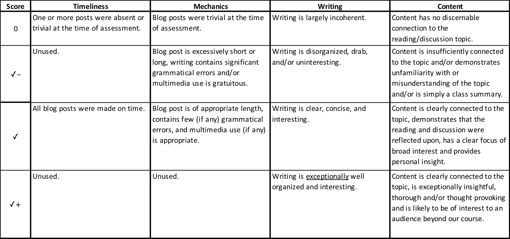
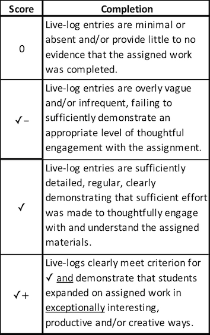
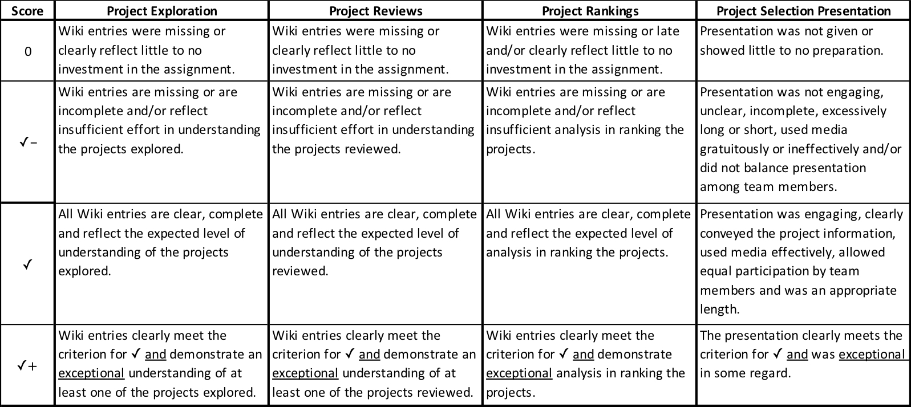
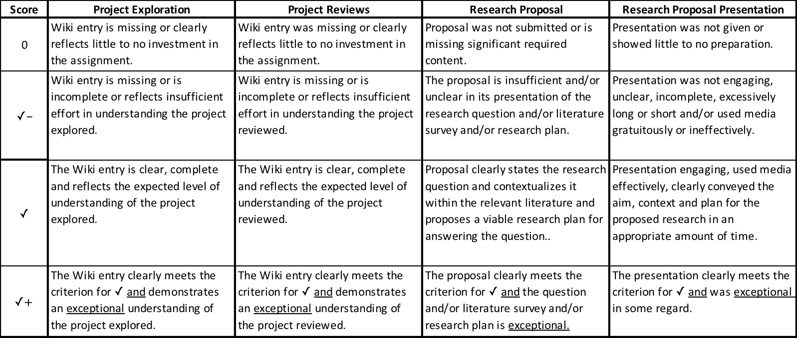
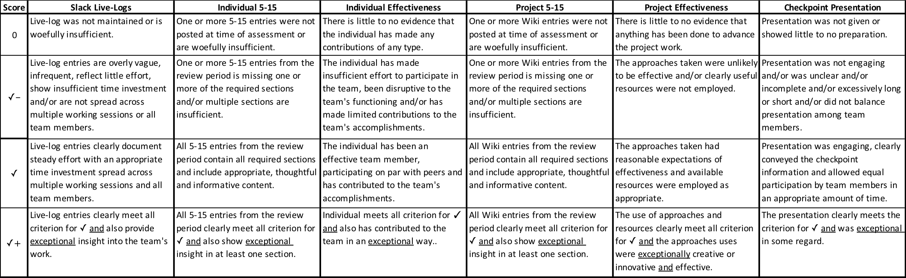
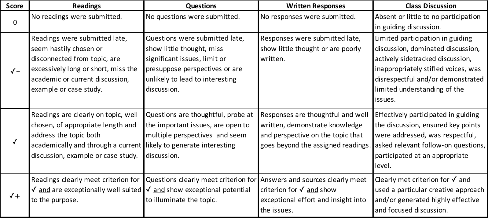
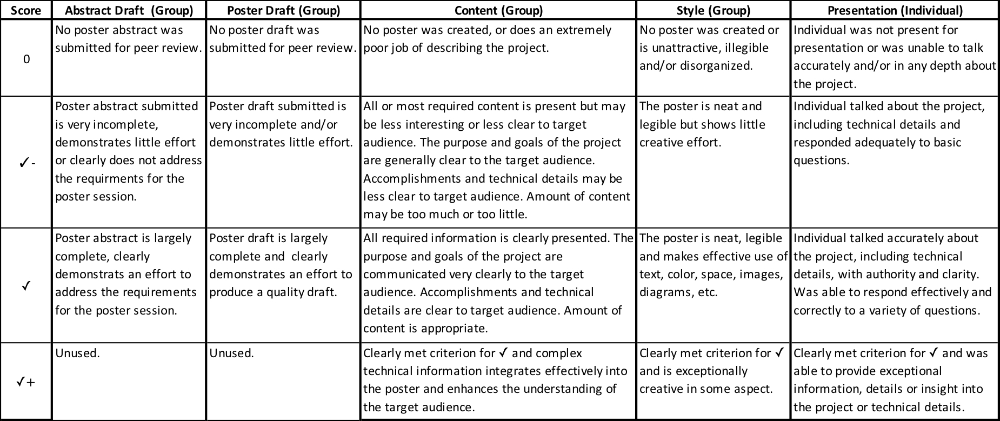

## Syllabus

### Course Description

The Senior Seminar (COMP491/492 combined) has three main components:

1. A year long project with two options:
   - Honors Research Projects: Students pursuing departmental honors will use their honors research project as their senior seminar project.
   - H/FOSS Projects: Students not pursuing departmental honors will become involved with a Free and Open Source Project (FOSS or Humanitarian FOSS - H/FOSS) and complete a sequence of four activities using their project and then planning additional work to be completed for the project, as time permits.
2. Readings, in-class exercises, homework, class discussions and reflective writings related to Free and Open Source Software (H/FOSS) and Software Engineering (491/fall).
3. Readings, discussions and reflective writings on ethical, legal and social issues related to computing (492/spring).

### Course Schedule

Assignment details including due dates and topics are indicated on the Course Home Page:
- https://dickinson-comp-491-492.github.io/website/

### Textbook

Reading materials for COMP491/492 will be provided via links on the course schedule or via Moodle.

### Learning Goals

Students will:
- improve their mastery in problem solving applicable to a wide variety of disciplines.
- become more prepared for graduate study in computing or to begin a professional career in computing.  
- participate in a year-long project that enhances their technical computing skill set in a way that is applicable, adaptable, and relevant to contemporary computing infrastructure, including large-scale projects and open source projects.  
- enhance their ability to work and collaborate in teams.  
- expand their understanding of social, legal and ethical issues raised by computing.  
- expand their perspectives on the value of computing, including: the role of computing in understanding the physical world, generating commercial value, advancing technology, and driving social change; and the transformational power of computing in service to the greater good.
- [WiD goal] enhance their ability to present technical information to an audience of computing professionals in both written and oral form.
- [WiD goal] develop their ability to write about and express an opinion on a social, legal or ethical issue in computing for a broad technical audience.

### 491 Grade Determination

Course Component                                    | Weight
----------------------------------------------------|---------
Preparation/Attendance/Engagement (PAE)             | 15%
Reflective Writing Blog Posts                       | 10%
Homework Exercises                                  | 15%
Project Selection                                   | 15%
Project Checkpoint #1                               | 15%
Project Checkpoint #2                               | 30%

### 492 Grade Determination

Course Component                                    | Weight
----------------------------------------------------|---------
Preparation/Attendance/Engagement (PAE)             | 15%
Blog / Reflective Writing (3)                       | 10%
Leading a Discussion	                              | 10%
Poster                                      	      | 20%
Project Checkpoint #1	                              | 15%
Project Checkpoint #2	                              | 30%

### Course Components

#### Participation/Attendance/Engagement (PAE)

The success of the Senior Seminar is in a large part up to you as its primary participants. Our hope is that you will all engage in the material, prepare carefully and come to our meetings excited to participate in discussions and activities with your peers. If that happens then our meetings will be lively and interesting and we will be able to focus largely on the aspects of the material that are most interesting to you as a group. Plus, its good practice - many employers are now using [Group Discussions as a screening technique before or during interviews!](https://www.reed.co.uk/career-advice/group-interview-tips-dos-and-donts/)

PAE is assessed for each individual during each class period. Preparation includes completion of any reading, tutorials, exercises or activities assigned. Attendance is your presence in class during our scheduled meetings. Engagement combines participation in discussion and activities with with a demonstrated investment both in the material and the betterment of the class for everyone.
- **NOTE: 2021-22** - While attendance is very important in this class, protecting our community is more important.  If you are feeling ill, please get in touch with your instructor, follow campus protocols and do not attend class. Alternative methods for participation and engagement will be provided.  Absences for illness will not affect this score.

PAE scores will be assigned according to the rubric below. The standard score in each category, and what you should generally expect to receive, is a ✓. Something exceptionally notable is required to move either up to a ✓+ or down to 0 or ✓-.  Rarely a ✓++ score may be given to recognize truly outstanding performance in a rubric category.

_Click rubric to enlarge image._ 

If you find class participation challenging, some good advice on increasing or improving class participation can be found at:
- [Ways to Improve Your Class Participation Experience](https://studylib.net/doc/18188459/ways-to-improve-your-class-participation-experience--sugg...): A short list of suggestions from Students from the Bureau of Study Counsel in the Center for Academic and Personal Development at Harvard University.
- [Class Participation: More Than Just Raising Your Hand](https://www.millersville.edu/gened/files/pdfs-faculty-handbook/class-participation-tutorial.pdf): A longer tutorial that may help you assess strengths and weaknesses and formulate a plan for improving your class participation.

#### Blog / Reflective Writing:

An important part of learning about and understanding issues is to reflect upon them after reading and discussion. This gives you a chance to process the information, organize your thoughts, incorporate insights from others. To facilitate this, you will write reflective blog posts following class discussions related to social/legal/ethical issues in computing. You are given wide latitude in these posts to reflect/expand on some aspect of the reading/discussion topic that was of interest to you. Doing so on a public-facing blog encourages careful thought, precise writing and can provide evidence of your knowledge and abilities to prospective employers and/or graduate programs.

The best posts will:
- be approximately 500 words.
- be closely related to the reading/discussion.
- be clear, focused and grammatically correct.
- be written to be of interest to an audience beyond our course.
- go beyond a mere summary of the reading/discussion.
- include multimedia (images, audio, video, etc.) only as appropriate to enhance the content of the post. Be sure that if you use any external content that you are using it in a way that is allowed by its license.

Blog posts will be assessed using the rubric below. The standard score, and what you should generally expect to receive, is a ✓. Something exceptionally notable is required to move either up to a ✓+ or down to 0 or ✓-. Rarely a ✓++ score may be given to recognize truly outstanding performance in a rubric category.

_Click rubric to enlarge image._ 

If you find writing blog posts challenging, some good advice on writing effective blog entries can be found at:
- [Effective Academic Blogging](http://writing2.richmond.edu/writing/wweb/blogging.html) from the Writer's Web at the University of Richmond Writing Center.
- [Blogs](http://writingcenter.unc.edu/handouts/blogs/) from The Writing Center at UNC-Chapel Hill.
- [Writing a Blog](Writing a Blog) workshop video from the Indiana University of Pennsylvania (IUP) Writing Center.
- There is no shortage of other advice, just google "How to write a blog" and find something that resonates with you and matches the goals of the course.

#### Tutorials / Homework Exercises

Early in the semester there will be a number of tutorials and homework assignments designed to introduce you to some of the tools and techniques commonly used in FOSS projects (and in professional software development as well). Typically these assignments will require you to complete some tutorials and activities while keeping a Slack Live-Log (see below) of your work

Tutorials and homework exercises will be assessed largely on completion and effort as documented by the associated Slack live-logs according to the rubric below. The standard score, and what you should generally expect to receive, is a ✓. Something exceptionally notable is required to move either up to a ✓+ or down to 0 or ✓-. Rarely a ✓++ score may be given to recognize live-logs that demonstrate truly outstanding learning beyond expectations.

_Click rubric to enlarge image._ 

#### Project/Community Selection or Research Proposal

Students pursuing H/FOSS projects will be assigned several preliminary exercises leading to the selection of an H/FOSS project/community. Each project group will then give a presentation on their selected project/community. Project/community selection will be assessed based on the completion and quality of the preliminary exercises and the presentation according to rubric below. The standard score, and what you should generally expect to receive, is a ✓. Something exceptionally notable is required to move either up to a ✓+ or down to 0 or ✓-. performance in a rubric category. Rarely a ✓++ score may be given to recognize truly outstanding performance in a rubric category. Additional assignment details will be posted on the course schedule.

_Click rubric to enlarge image._ 

Students pursuing Departmental Honors will turn in a copy of their Research Proposal and give a presentation of their proposed research. Students pursuing Honors will also complete a reduced version of the Project/Community Selection exercises to provide an appropriate introduction to H/FOSS projects and communities. The Research Proposal will be assessed, with input from the Honors Advisors, based on the quality of the written proposal and presentation. The proposal and the Project/Community selection exercises will be assessed according to rubric below. The standard score, and what you should generally expect to receive, is a ✓. Something exceptionally notable is required to move either up to a ✓+ or down to 0 or ✓-. Rarely a ✓++ score may be given to recognize truly outstanding performance in a rubric category.

_Click rubric to enlarge image._ 

#### Project Checkpoints

At each Project Checkpoint the work on the project since the last checkpoint will be assessed. The assessment will include the following elements:
- Slack Live-Logs (H/FOSS projects only / see below)
- Individual 5-15 (H/FOSS projects only / see below)
- Instructor's assessment of individual effectiveness (H/FOSS projects only)
- Team 5-15 or Honors 5-15 (see below)
- Project Checkpoint Presentation. This presentation should briefly reintroduce the project and then address: what has been accomplished since the prior checkpoint, what challenges have been overcome and how, what has been learned, what impediments are being faced currently and how they will be overcome. These presentations should also include live demonstrations that highlight accomplishments. The presentation should conclude with reflection on what has been learned in a broad context and what can be improved on going forward. Note that the presentation does not need to cover every detail in depth. Rather it should go into depth on some of the more interesting aspects and can just list the other aspects. Overall, it is important that the presentation tell a cohesive, interesting, understandable story about the work to the target audience.
- Instructor's assessment of the individual's effectiveness in advancing the team's project work. For honor's projects the thesis advisor will be consulted in making this assessment.

Project Checkpoints will be scored using the rubric below. The standard score, and what you should generally expect to receive, is a ✓. Something exceptionally notable is required to move either up to a ✓+ or down to 0 or ✓-. Rarely a ✓++ score may be given to recognize truly outstanding performance in a rubric category.

_Click rubric to enlarge image._ 

#### Leading a Discussion
Class readings and discussions during the spring semester will focus on contemporary social, legal and ethical issues in computing. The professor will establish the basis for these discussions during the first several weeks of the course through readings and discussions of ethical frameworks and case studies of their application. Students, in small groups, will select the topics, identify readings and prepare and lead a class discussion.

Work for this assignment will consist of three main components:
1. **Topic Selection:** Topics will be identified and selected; groups and dates for discussion will be assigned during the first week of class. In addition, it is highly recommended that each group visit with the professor to discuss their topic and their approach to it. The professor will be able to help shape and focus the topic and may be able to suggest resources and possible readings for your topic.
2. **Preparation:** In preparation for leading your discussion the following elements are required:
   1. _Readings:_ Identify reading(s) for the class to complete before the discussion. The reading(s) should provide both an academic overview of the topic area and a current discussion, example or case study. You may find it helpful to use both library and on-line searches to find the most appropriate materials. You are expected to read much more about your topic than you assign to the class. This is to better inform you about the topic and to ensure that you are well informed on it as you begin to prepare to lead the discussion. The list of readings that you plan to assign is _due to the professor two weeks prior to your discussion date._ You are highly encouraged to discuss your reading lists with the professor prior to the submitting the final list.
   2. _Questions:_ Develop a list of 3-5 questions for class discussion. These questions should be designed to address the important issues, facilitate the examination of the issue from different perspectives and lead to engaging conversation during class. Your list of questions is due to the professor _one week prior to your discussion date._ You are highly encouraged to discuss your questions with the professor prior to the submitting the final list.
   3. _Plan the Discussion:_ The group must decide how to run the discussion (see Leading a Discussion below) and identify the key points to be sure are raised in the discussion. Your plan should include the questions you posed, trying to anticipate different views and thinking about how to respectfully challenge the views that arise.
   4. _Written Responses:_ Each member of the discussion group must submit an individually written response (~1 paragraph each) for each of the questions that have been posed. These responses are to be submitted to Moodle by 8am on the day of the discussion.
   5. _Review Moodle Forum Posts:_ Before leading the discussion the group members must review the forum posts made by the rest of the class. You are not expected to change your plan for the discussion based on these posts. Rather, having read them you will know better what to expect during the discussion. This will enable you to ask effective follow-on questions or to draw out interesting perspectives that have been expressed by your classmates by asking them to contribute.
3. **Leading Class Discussion:** Lead the class discussion in a well organized, thoughtful and effective manner. This will include exercising appropriate control over the discussion, ensuring all voices are heard and respected, making sure that the most significant points are addressed and moving through the topics at a reasonable pace.

Class discussions will be scored using the rubric below. The standard score, and what you should generally expect to receive, is a ✓. Something exceptionally notable is required to move either up to a ✓+ or down to 0 or ✓-. Rarely a ✓++ score may be given to recognize truly outstanding performance in a rubric category.

_Click rubric to enlarge image._ 

 _Note: Some language adapted from John MacCormick's earlier offering of this course._

You can be creative in how you organize and run the discussion. You might model your class on what you have experienced in other courses or other settings. The following sites also give some good advice on leading discussions:
  - [The Big List of Class Discussion Strategies](https://www.cultofpedagogy.com/speaking-listening-techniques/) on Jennifer Gonzalez's Cult of Pedagogy blog.
  - [13 Strategies to Improve Student Classroom Discussion](https://www.weareteachers.com/13-strategies-to-improve-student-classroom-discussions/) from the WeAreTeachers Site.
  - [Discussion Strategies](https://ctl.wustl.edu/resources/discussion-strategies/) from The Teaching Center.

#### Poster Presentation
Posters have become a common mechanism for presenting project results at professional meetings and conferences. This assignment provides experience developing a poster and presenting your work in a less formal small group or one-on-one setting. Students will present their poster at the Science Research Symposium or the [Civic Engagement Symposium](https://www.dickinson.edu/info/20378/civic_engagement/4213/civic_engagement_symposium). The course faculty will work with teams to determine the appropriate venue.

##### Poster Content and Audience

- Science symposium posters should emphasize the research question being addressed, the methods used and the results obtained.
- Civic Engagement Symposium posters should emphasize the need addressed by the application, the user and developer communities, interactions with those communities, the interactions and contributions that you have made and what you have learned from the experience.  More details on the expectations for this type of poster are available on the [Civic Engagement Symposium](https://www.dickinson.edu/info/20378/civic_engagement/4213/civic_engagement_symposium) site.
- The target audience for the posters should be other students and faculty who are unfamiliar with your project and also are not studying computer science. Note: This does not imply that you should not include any code, but you'll need to plan and contextualize carefully to make your points to this audience!
- Consider whether having a live demo as part of your presentation makes sense. If so, use a laptop beside the poster for the demo.

##### Poster Creation
- Posters should be a maximum of 36"h x 44"w.
- Posters titles should be legible from 20 feet. Other content should be clearly legible from 4-6 feet.
- Creating your poster as a single large PowerPoint slide is a relatively easy approach. Search for [PowerPoint Poster Templates](https://www.google.com/search?q=powerpoint+poster+templates&oq=power+point+poster+tem&aqs=chrome.1.69i57j0l5.7495j0j7&sourceid=chrome&ie=UTF-8) to find lots of predefined templates you can adapt to your needs. Or, express your own style by setting the slide size in PowerPoint to the size of the poster you want and laying everything out yourself!
- Use the posters hanging around the department as examples. Read a few of them and emulate the ones you feel do a good job. In addition, there are a number of good sites that give advice on producing poster for presentations:
   - [Ten Simple Rules for a Good Poster Presentation](https://www.ncbi.nlm.nih.gov/pmc/articles/PMC1876493/) from PLos Computational Biology, May 2007.
   - [Make a Good Poster](https://undergrad.stanford.edu/opportunities/research/go-further/surpsasurps/make-good-poster) - Video and tips from the Undergrad Research and Independent Projects site at Stanford.
   - [Poster Presentation Information](https://in.nau.edu/undergraduate-research/poster-presentation-information/) from the Division of Undergraduate Research at Northern Arizona University.
   - [Effective Poster Presentations](https://cirt.gcu.edu/research/developmentresources/tutorials/posterpresent) from the Center for Innovation and Research in Teaching at Grand Canyon University. The embedded videos are helpful!

Posters will be scored using the rubric below. The standard score, and what you should generally expect to receive, is a ✓. Something exceptionally notable is required to move either up to a ✓+ or down to 0 or ✓-. Rarely a ✓++ score may be given to recognize truly outstanding performance in a rubric category.

   _Click rubric to enlarge image._ 
   
    _Note: Some language adapted from John MacCormick's earlier offering of this course._

### Time & Effort Documentation Tools

#### Slack Live-Logs

All students will be required to keep Slack Live-Logs for the early homework assignments, as described above. In addition, FOSS Project teams will be required to maintain Slack Live-Logs for their project work throughout the remainder of the semester.

A Slack Live-Log is just a series of messages posted to a Slack channel as you work. The messages should paint a rough picture of what you are doing, when you did it and any other interesting/useful tidbits to be remembered while you are working. Ideally, when working in a pair, one partner will be controlling the machine where the project work is happening and the other will be live-logging on another machine. These roles should be swapped regularly. It is not necessary to document every tiny thing, and you don't have to use polished language, grammar and punctuation. You can see a sample live-log in the sample-live-log channel in the COMP491 Slack team.

For homework assignments the Slack Live-Log will be used to demonstrate that you have worked through the appropriate exercises, tutorials and assignments.

For FOSS Project work the Slack Live-Log will be used to demonstrate an appropriate investment of time and quality effort in the project work, as well as to document your progress through the project guides. Each of you has different experience and every FOSS project has different technical challenges. Thus, some tasks will be easier (or harder) than others and what is accomplished will vary between teams, from week-to-week and between projects. Thus, rather than relying solely on final products for credit teams will be expected to invest an appropriate amount of time and effort on their project work each week. Slack Live-Logs provide the mechanism for documenting the time and effort invested in the project.

In addition to keeping a record of what a team has done and how long it has worked, these live-logs are intended to encourage teams to practice and demonstrate that they are working via steady, sustained engagement rather than in long irregular bursts. Working via steady, sustained engagement is more effective, more productive and less frustrating than working in long irregular bursts. It allows time to process information, generate new ideas, communicate with faculty, peers and the project's development community.

#### Five-Fifteen
A [five-fifteen report](https://www.contractingbusiness.com/archive/article/20864629/the-fivefifteen-report) is a short weekly templated report that is designed to enhance communication, reflection, prioritization, goal setting and time management without being time consuming. The name five-fifteen reflects that the report should take no more than five minutes to read and no more than fifteen minutes to write.

We will use three types of 5-15 reports to reflect on your accomplishments, your self and your team, and to identify and plan future work. H/FOSS project students will complete Individual 5-15s and Team 5-15s. Honor's student's will complete a 5-15 tailored for individual research projects.

All 5-15's will be maintained as a Wiki page with the most recent entry at the top. Individual 5-15's will be linked with your personal information on the course Wiki (i.e. on the page with your blog and git links). Team and Honor's 5-15's will be linked from the project Wiki page.

Successive 5-15s should relate back to prior 5-15s to make clear how things that were planned turned into accomplishments, how thoughts on how to improve team function were enacted, how challenges/roadblocks were overcome, etc.

##### Individual 5-15

Each individual 5-15 must have the headings given below and each must be followed by a few sentences or an annotated list.

1. Period Ending (mm/dd/yyyy)
2. What did my team accomplish?
3. How did I contribute to those accomplishments?
4. What did I learn / How did I improve?
5. How can I improve?

##### Team 5-15

Each Team 5-15 must have the headings given below and each must be followed by a few sentences or an annotated list.

1. Period Ending (mm/dd/yyyy)
2. What were the team's accomplishments?
3. What Interactions did the team have with the community? Include links to any interactions that are publicly accessible (e.g. posting to list serve, comment on an issue, etc.)
5. What Contributions did the team make to the community? Include links to any publicly accessible contributions (e.g. documents, pages, new/refined/edited/closed tickets, pull requests, etc.)
6. How is the team functioning? How can it be improved?
7. What technical challenges/roadblocks does the team face?
8. What's next?
9. What steps will the team take to accomplish that? Who? When?

##### Honors 5-15

Each Project 5-15 must have the headings given below and each must be followed by a few sentences or an annotated list.

1. Period Ending (mm/dd/yyyy)
2. What did I accomplish?
3. What did I learn?
4. What challenges/roadblocks do I face?
5. What's next?
6. What steps will I take to accomplish that? When?

### Academic Integrity

Please take the time to read the Academic Misconduct section of [Dickinson's Community Standards](https://www.dickinson.edu/download/downloads/id/11821/community_standards.pdf). Violations of this policy are considered serious transgressions, so you should be especially certain that you understand your rights and responsibilities under it. Students suspected of academic dishonesty will be subject to the process outlined in the [Student Conduct](http://www.dickinson.edu/homepage/69/student_conduct) pages. The specific collaboration policies for each component of this course are detailed in the assignments. If you are unsure about whether or not certain kinds of collaboration are permissible on an assignment or in this course, ask your instructor

### Intellectual Property Rights

Audio or video recording of class meetings, lectures or discussions is prohibited without explicit permission of the instructor. Photographic records of whiteboards, projected slides or other visual media is also prohibited without explicit permission of the instructor. In any case where permission is given for audio/video/photographic records to be made they are for personal use only. They may not be shared or redistributed and must be destroyed at the end of their usefulness or within one week following the termination of this course, whichever comes first. Similarly, any redistribution of sample code, homework solution sets or provided lab code is prohibited. Please note that all outside materials used in the course (readings/tutorials/assignments/projects/etc) are also be governed by their own licensing agreements.

### Accommodations for Disabilities

Dickinson values diverse types of learners and is committed to ensuring that each student is afforded equitable access to participate in all learning experiences. If you have (or think you may have) a learning difference or a disability – including a mental health, medical, or physical impairment – that would hinder your access to learning or demonstrating knowledge in this class, please contact Access and Disability Services (ADS). They will confidentially explain the accommodation request process and the type of documentation that Dean and Director Marni Jones will need to determine your eligibility for reasonable accommodations. To learn more about available supports, go to [www.dickinson.edu/ADS](https://www.dickinson.edu/ADS), email access@dickinson.edu, call (717) 245-1734, or go to the ADS office in Room 005 of Old West, Lower Level (aka "the OWLL").

If you’ve already been granted accommodations at Dickinson, please follow the guidance at [www.dickinson.edu/AccessPlan](https://www.dickinson.edu/AccessPlan) for disclosing the accommodations for which you are eligible and scheduling a meeting with me as soon as possible so that we can discuss your accommodations and finalize your Access Plan. If test proctoring will be needed from ADS, remember that we will need to complete your Access Plan in time to give them at least one week’s advance notice.

“Our classroom / My office is located on the second floor of Tome Hall, which has an elevator, located to the left of the main entrance. If you require the use of an elevator to access the second floor, please let me know. If there is ever a malfunction with the elevator please let me know (e.g. via Teams or e-mail).  I will if necessary relocate or hold class virtually. Similarly, if you are ever unable to reach my office for office hours or a meeting I will be happy to move the meeting to an accessible location or hold it virtually.

### Life Happens:

Sometimes stuff just happens, even more so in the challenging situations in we currently find ourselves. Sometimes it is an unexpected sudden event such as an illness or family emergency. Other times it may be an ongoing issue or concern or an accumulation of smaller issues. Any of these things may affect your (or my) ability to focus or perform up to your (or my) potential through no shortcoming or fault of your (my) own. Dickinson is a kind and caring community and we want to see you achieve at your full potential. So, if you are experiencing life events that are affecting your performance please don’t hesitate to talk to your instructor, your advisor or your class Dean. They will all be willing to talk with you, help to formulate a plan and/or connect you with others that may be able to assist. If I am experiencing such events, I will communicate them to you as well and we will adapt.
